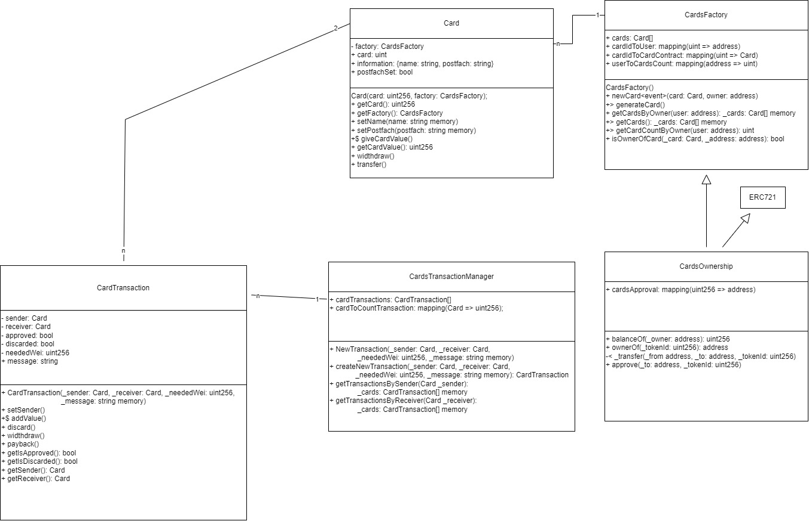

# Work in Progress

## How To:
1. Install MetaMask
2. ```npm install```
3. ```npx hardhat compile```
4. ```npx hardhat node```
5. Import Account into MetaMask (private key)
6. ```npx hardhat run scripts/deploy-cards-contract.js --network localhost```
7. Import address (src/address.json) into MetaMask to see NFT
8. ```npm run dev```

## Smart Contract Diagramm (WIP)
### meanings
- +> external
- -< internal
- +$ public payable




## Commands
```shell
npx hardhat accounts
npx hardhat compile
npx hardhat clean
npx hardhat test
npx hardhat node
node scripts/sample-script.js
npx hardhat help


npx hardhat compile
npx hardhat node
npx hardhat run scripts/sample-script.js --network localhost
```
